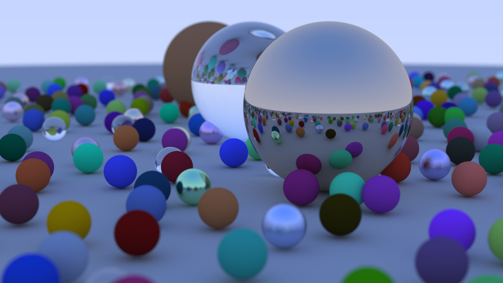

# Ray Tracer

---

## Overview

This project implements a complete Monte Carlo path tracer in two forms: a sequential CPU implementation in C++, and a parallel GPU implementation using CUDA. Both renderers produce identical output — a physically-based scene with Lambertian diffuse, metallic, and dielectric (glass) materials, depth-of-field blur, and multi-sample anti-aliasing.

The CPU implementation lives on the `main` branch. The CUDA port lives on the `cuda` branch.


*The benchmark scene rendered at 1080px, 500 spp, `max_depth = 50`.*

---

## How It Works

Path tracing simulates light transport by casting rays from a virtual camera into a scene. For each pixel, many rays are cast and allowed to bounce through the environment, accumulating color contributions from scattered light. The final pixel color is a **Monte Carlo estimate** of the rendering integral — the average over many random ray paths.

The algorithm is extremely parallel: each pixel's rays are statistically independent of every other pixel's. There is no shared mutable state between pixels, no inter-pixel communication, and no ordering constraint — making it a natural workload for GPU acceleration.

### Materials

| Material | Behaviour |
|----------|-----------|
| **Lambertian** | Scatter direction $\hat{n} + \vec{r}$ where $\vec{r}$ is a random unit vector. Approximates ideal diffuse reflectance. |
| **Metal** | Reflect incoming direction about the surface normal, perturbed by a fuzz factor for rough metals. |
| **Dielectric** | Refract using Snell's law, with total internal reflection and Schlick's approximation for probabilistic reflection vs. refraction. |

Rendered output is written as a **PPM (Portable Pixmap)** file — a plain-text image format where each pixel is written as three ASCII integers (R, G, B, 0–255). No external library required.

---

## CPU Implementation (`main`)

Single-threaded C++. The scene is a `hittable_list` — a `std::vector` of `std::shared_ptr<hittable>` — using virtual dispatch for material scattering. Ray bounces are implemented as direct recursion inside `ray_color()`.

**Build and run:**
```bash
g++ -O2 -o raytracer *.cpp
./raytracer > output.ppm
```

**Camera parameters** (configured in `main.cpp`):
```cpp
cam.image_width       = 400;
cam.samples_per_pixel = 100;
cam.max_depth         = 50;
cam.vfov              = 20;
cam.defocus_angle     = 0.6;
cam.focus_dist        = 10.0;
```

---

## CUDA Implementation (`cuda`)

The GPU port required substantial architectural changes — not stylistic choices, but requirements imposed by the hardware and runtime:

- **No virtual dispatch** — vtable pointers are invalid on device. Replaced the `material` class hierarchy with a flat `Material` struct and a `switch`-dispatched scatter function.
- **No `shared_ptr` or STL containers on device** — scene passed as a raw `Sphere*` array via `cudaMalloc` / `cudaMemcpy`.
- **Iterative ray bouncing** — recursive device functions risk stack overflow. `ray_color()` rewritten as an iterative loop accumulating attenuation.
- **Per-thread RNG** — each thread holds its own `curandState`, initialized by a setup kernel.
- **`float` instead of `double`** — 32-bit float throughput is substantially higher on consumer GPUs.

**Build and run:**
```bash
nvcc -O2 -o raytracer *.cu
./raytracer > output.ppm
```

---

## Benchmark Results

All benchmarks use the final scene (~470 spheres, `max_depth = 50`, `aspect_ratio = 16:9`). Hardware: RTX 4050.

### CPU Render Times (seconds)

| Width | 64 spp | 128 spp | 256 spp | 500 spp |
|-------|--------|---------|---------|---------|
| 400   | 20.10  | 41.02   | 79.79   | 154.42  |
| 720   | 64.38  | 130.11  | 253.87  | 498.33  |
| 1080  | 144.62 | 292.89  | 571.03  | 1118.24 |

### GPU Render Times (seconds)

| Width | 64 spp | 128 spp | 256 spp | 500 spp |
|-------|--------|---------|---------|---------|
| 400   | 0.401  | 0.750   | 1.426   | 2.732   |
| 720   | 1.096  | 2.088   | 4.112   | 7.978   |
| 1080  | 2.267  | 4.432   | 8.785   | 17.095  |
| 1440  | 3.959  | 7.714   | 15.368  | 29.692  |

### Speedup

The GPU achieves **50–65× speedup** over the single-threaded CPU, with the advantage increasing at higher resolutions as GPU occupancy improves. Speedup is roughly constant across SPP values at a given resolution — SPP is sequential work per thread on both platforms, so it scales identically and doesn't affect the ratio.

### Thread Block Size (1080px, 500 spp)

| Block | Threads/block | Time (s) |
|-------|--------------|----------|
| 4×4   | 16           | 0.35     |
| 8×8   | 64           | 4.288    |
| 16×16 | 256          | 17.065   |
| 32×8  | 256          | 6.892    |
| 8×32  | 256          | 9.333    |
| 4×64  | 256          | 4.88     |
| 64×4  | 256          | 1.56     |

Optimal block dimensions are kernel-specific and resource-dependent. Large blocks exhaust per-SM register budgets (each thread allocates a `curandState` ~48 bytes plus ray tracing register pressure), causing silent kernel failure. Square tile shapes are not always faster than rectangular ones for non-square image formats.

---

## Limitations

- **Single-threaded CPU baseline** — the reported speedup is GPU vs. single-threaded CPU. A parallelized CPU renderer (OpenMP / `std::thread`) would yield a more conservative comparison.
- **`float` vs. `double`** — the GPU uses 32-bit float; the CPU uses 64-bit double. Not identical arithmetic, though the visual difference is negligible.
- **Measurement scope** — GPU timing covers kernel execution only (excludes `cudaMemcpy`). CPU timing covers the pixel loop only (excludes scene construction).

---

## References

- Peter Shirley, Trevor David Black, Steve Hollasch. *Ray Tracing in One Weekend*, April 2025. https://raytracing.github.io/books/RayTracingInOneWeekend.html
- NVIDIA Corporation. *CUDA C++ Programming Guide*, 2024. https://docs.nvidia.com/cuda/cuda-c-programming-guide/